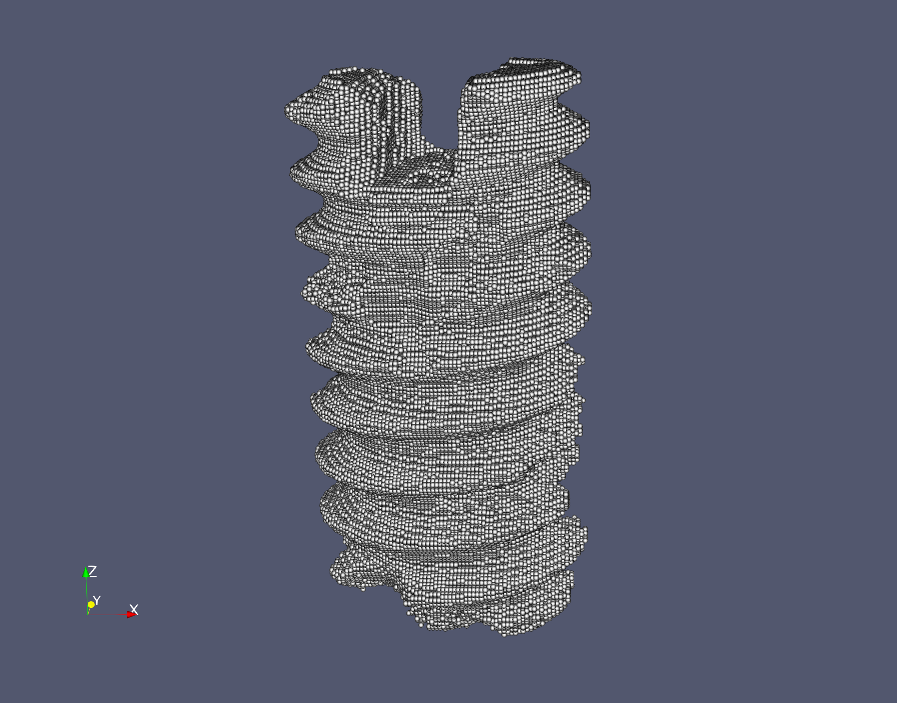

# tiff2csv

This is a simple python package for processing ```.tif``` image data and outputting ```.csv``` files.
The intention is to operate on a sequence of ```.tif``` images and, based on a given discretization size, 
output a ```.csv``` file containing the voxel data. 
You can find the Github repository on https://github.com/alhermann/tiff2csv.git.

## Getting started 

You can use the Python package manager Pip for downloading the module from https://pypi.org/project/tiff2csv.

```pip3 install tiff2csv```

## Example

Suppose you have stored a stack of ```.tif``` image files in an upper subdirectory called ```../tiffs```. In order to run the main module, you have to provide this path as a mandatory argument. For the description of additional arguments, you can use the ```-h```or ```--help``` flag

```python3 -m tiff2csv --help```

which produces the following output:


```
usage: __main__.py [-h] [-n imgNum] [-r resolution] [-d dFile] [-p pooling]
                   [-k poolingKernel]
                   sFile [sFile ...]

Script that reads a sequence of .tif files and outputs .csv file of voxel data
to user specified directory

positional arguments:
  sFile             the source file of the .tif image sequence

optional arguments:
  -h, --help        show this help message and exit
  -n imgNum         number of .tif images
  -r resolution     voxel resolution in the .tif images
  -d dFile          the destination directory where the output should go to
  -p pooling        optionally activate 2D pooling on the input images
  -k poolingKernel  optionally pass a kernel size for 2D pooling (default = 5)
```

For an exemplary CT image resolution of 5mu the following command runs a max-pooling compression on the input image data files and outputs a ```voxelization.csv``` voxel data file to user specified (in this case parent) directory.

```
python3 -m tiff2csv ../tiffs/ -r 5e-6 -d ../ -p True -k 5
```


